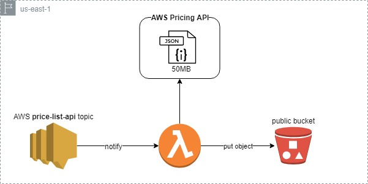

# AWS Pricing

## Prerequisites
* `set S3_BUCKET=am-aws-pricing`
* `aws s3 mb s3://%S3_BUCKET%`

## Package
* `aws cloudformation package --template-file sam-template.yaml --s3-bucket %S3_BUCKET% --output-template-file cf-template.yaml`

## Deploy
* `aws cloudformation deploy --template-file cf-template.yaml --stack-name %S3_BUCKET% --capabilities=CAPABILITY_IAM --parameter-overrides BucketAndFunctionNameParameter=%S3_BUCKET%`

## Update (optional)
* `aws cloudformation update-stack --template-body file://cf-template.yaml --stack-name %S3_BUCKET% --parameters ParameterKey=BucketAndFunctionNameParameter,ParameterValue=%S3_BUCKET% --capabilities CAPABILITY_AUTO_EXPAND CAPABILITY_IAM`

## Test
* `aws lambda invoke --function-name %S3_BUCKET% --log-type Tail --payload file://test/TriggerPricesPayload.json outputfile.txt`

## Misc
* `aws cloudformation delete-stack --stack-name %S3_BUCKET%`

# Download CSV from
https://s3.amazonaws.com/%S3_BUCKET%/prices.csv